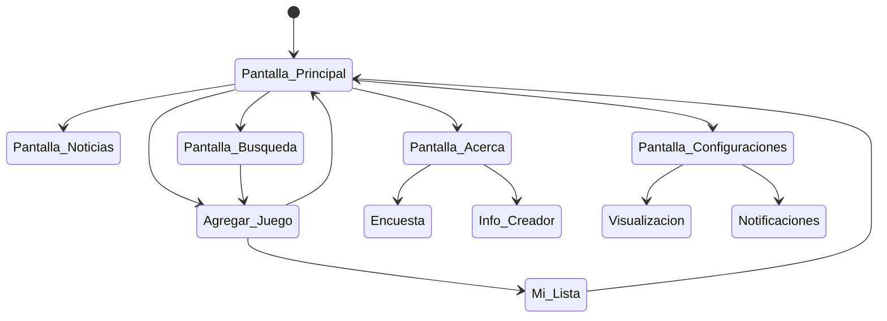

# Gamer point 

Es una aplicacion orientada a la comunidad gamer, en la cual el usuario puede hacer una lista de los videojuegos que haya jugado o este jugando cuando quiera.

## Caracteristicas

- La aplicacion permite agregar un videojuego a la lista.
- La aplicacion permite asignarle un puntaje a los videojuegos de la lista.
- La aplicacion permite poder cambiar el estado del videojuego de la lista (Jugando/terminado/Interesado/Dropeedo).
- La aplicacion permite al usuario agregar una opinion con respecto al juego añadido.
- La aplicacion permite editar la informacion añadida.
- La aplicacion permite visualizar la cantidad de entradas añadidas.
- La aplicacion permite eliminar una entrada.
- La aplicacion puede contar con las caratulas de los juegos que se añada de manera manual.
- La aplicacion cuenta con la pantalla de "Inicio", "Noticias" "Acerca de" ,"Buscar" y "Configuraciones.
- La pantalla principal cuenta con la lista de juegos que el usuario agrega.
- La pantalla de buscar permite buscar juegos de la base de datos RAWG e importarlos a la lista.
- La pantalla de Noticias permite al usuario visualizar noticias.
- La aplicación permite añadir juegos manualmente o usando un autocompletado de la API de RAWG.
- La aplicación rellena automáticamente la sinopsis, portada, género y plataformas si se usa la API.
- La aplicación pide confirmación ("¿Estás seguro?") antes de eliminar una entrada.
- La aplicación envía recordatorios inteligentes para juegos en estado "Jugando" o "Interesado".
- El usuario puede activar o desactivar los recordatorios con un interruptor general.
- El usuario puede configurar la frecuencia de los recordatorios (7, 14, 21 o 30 días).
- La aplicación maneja los permisos de Android 16 (Alarmas Exactas) para que las notificaciones funcionen.
- La aplicación cuenta con botones de prueba para verificar las notificaciones (inmediata y 10 seg).
- El usuario puede cambiar la visualización de la lista (Cuadrícula/Lista), el tamaño de portadas y el orden.
- La aplicación cuenta con una Base de Datos Rápida (Hive) para funcionar sin conexión.
- La aplicacion cuenta con autenticación con Google mediante FireBase
- El usuario puede realizar guardado en la nube de forma manual, automatica y restaurar copias
- La aplicacion cuenta con filtrado por fechas que existen en la lista
- La aplicacion cuenta con el parametro de fechas al momento de agregar un juego

- Link del apk
- https://drive.google.com/file/d/1xGKzZd-igvOs6_ESg4GFwXM4rMVbqXmF/view?usp=sharing

