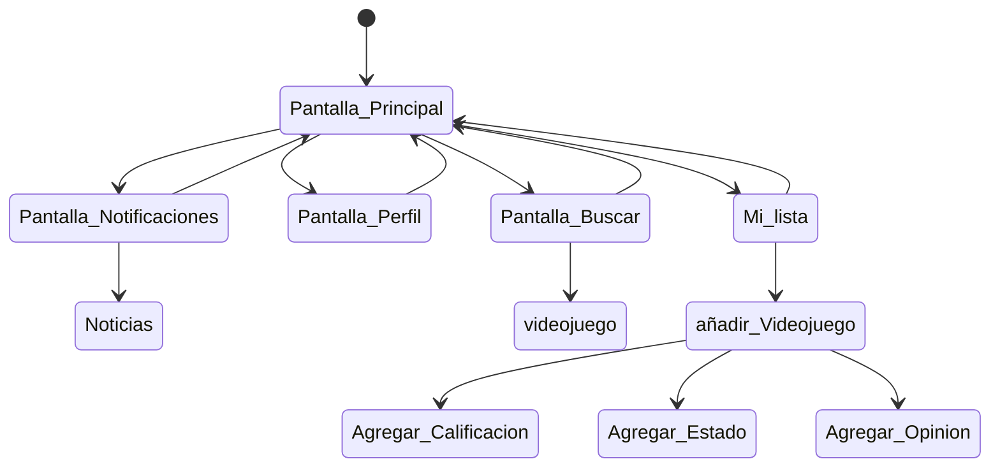

# Gamer point 

Es una aplicacion orientada a la comunidad gamer, en la cual el usuario puede hacer una lista de los videojuegos que haya jugado o este jugando cuando quiera.

## Caracteristicas

- La aplicacion permite agregar un videojuego a la lista.
- La aplicacion permite asignarle un puntaje a los videojuegos de la lista.
- La aplicacion permite poder cambiar el estado del videojuego de la lista (Jugando/terminado/Interesado/Dropeedo).
- La aplicacion permite al usuario agregar una opinion con respecto al juego añadido.
- La aplicacion permite editar la informacion añadida.
- La aplicacion permite visualizar la cantidad de entradas añadidas.
- La aplicacion permite eliminar una entrada.
- La aplicacion puede contar con las caratulas de los juegos que se añadan.
- La aplicacion cuenta con la pantalla de "Inicio", "Noticias" "Acerca de" y "Buscar.
- La pantalla principal debe contar con juegos en general y diversas entrdas de mi interes.
- La pantalla de buscar permite buscar juegos y otros.
- La pantalla de Noticias permite al usuario visualizar noticias que sube la comunidad.

