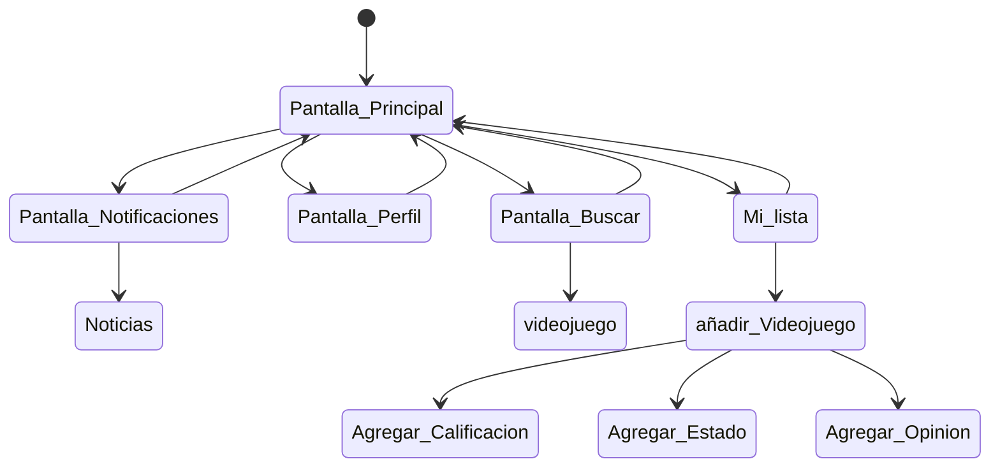

# Gamer point 

Es una aplicacion orientada a la comunidad gamer, en la cual el usuario puede hacer una lista de los videojuegos que haya jugado o este jugando cuando quiera y asi compartirlo con sus amigos u otras personas.

## Caracteristicas

- La aplicacion debe permitir agregar un videojuego a la lista.
- La aplicacion debe permitir asignarle un puntaje a los videojuegos de la lista.
- La aplicacion debe permitir poder cambiar el estado del videojuego de la lista (Jugando/terminado/Interesado/Dropeedo).
- La aplicacion debe permitir al usuario agregar una opinion con respecto al juego añadido.
- La aplicacion debe permitir editar la informacion añadida.
- La aplicacion debe permitir visualizar la cantidad de entradas añadidas.
- La aplicacion debe permitir eliminar una entrada.
- La aplicacion debe permitir crear una cuenta, añadirle una biografia y poder visualizar a grandes rasgos la lista.
- La aplicacion debe contar con las caratulas de los juegos que se añadan.
- La aplicacion debe permitir visualizar la lista de amigos añadidos.
- La aplicacion debe contar con los juegos que se añadan para buscarlos.
- La aplicacion debe contar con las pantallas de "Principal", "Notificaciones", "Perfil", "Buscar" y "Mi lista".
- La pantalla principal debe contar con juegos en general y diversas entrdas de mi interes.
- La pantalla Notificaciones debe mostrar avisos segun juegos que haya añadido.
- La pantalla de buscar debe permitir buscar juegos y otros.
- La pantalla de Mi lista debe permitir añadir juegos a la lista, filtrarlos segun su estado, editarlos y elimintarlos ademas de visualizar la cantidad de entradas.

